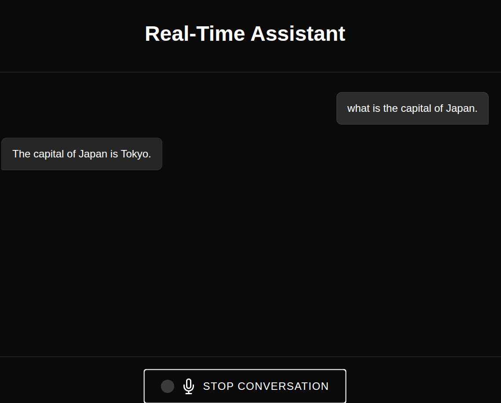

# Voice Assistant

A low-latency voice assistant that listens for commands and responds. 

## Features

- Responds to questions
- Checks weather status 

### To do
- Fast song search and playback on Spotify

## Project Structure

```
assistants/
├── README.md
├── pyproject.toml
├── src/
│   ├── cli/
│   │   ├── __init__.py
│   │   └── conf/
│   │       ├── __init__.py
│   │       └── base.yaml
│   ├── __init__.py
│   ├── main.py
│   ├── model.py
│   ├── util.py
│   └── index.html

```

## Installation

1. Clone this repository:
   ```
   git clone https://github.com/vigneshsrinivasan10/assistants.git
   cd assistants
   ```

2. Install the package:
   ```
   uv sync
   source .venv/bin/activate 
   ```
3. Download the LLM of choice: 
   ```
   mkdir models
   cd models
   wget https://huggingface.co/TheBloke/Mistral-7B-Instruct-v0.1-GGUF/resolve/main/mistral-7b-instruct-v0.1.Q4_K_M.gguf
   cd ..
   ```

## Configuration

All configuration is stored in `assistant/src/cli/conf/base.yaml`:

### Models Used

- Speech-to-text 
Whisper simple model from the library `fastrtc_whisper_cpp`: 
```small.en-q5_1```
Smaller models like `base` and `tiny` can be used to make this faster but the quality suffers. 

- LLM 
Mistral 7B from TheBloke using the library `llama_cpp`: 
```mistral-7b-instruct-v0.1.Q4_K_M.gguf``` 

- Text-to-speech 
Kokoro used within the library `fastrtc`.  

### Wake word and pause detection

- By default, the wake word is set to `computer`. 
- Pause detection and interruption is performed using the `fastrtc` library. 

## Usage
```
assistant
```
Then open the link on your favorite browser: 
```
http://127.0.0.1:7860
```
and click on `start conversation`.  

## How it works

1. The assistant continuously listens for the wake word "computer"
2. When detected, it transcribes what you speak
3. It queries the transcription to an LLM
4. Converts the output of the LLM to audio and responds

E.g.: 
```
User: Computer(wake-word), what is the capital of Japan.
Response: The capital of Japan is Tokyo.
```



## License

MIT 
